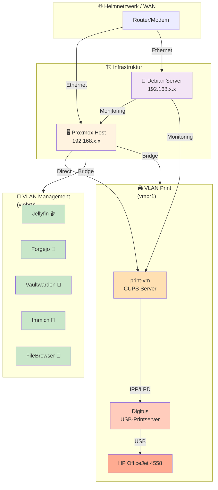
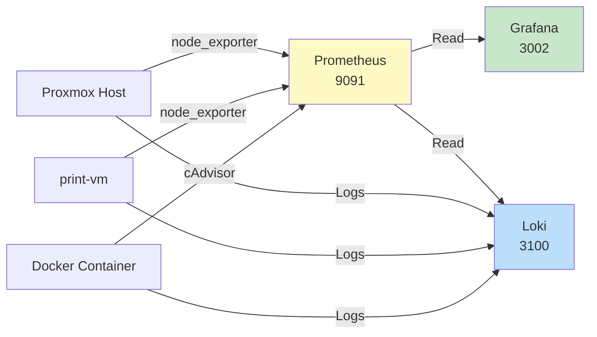
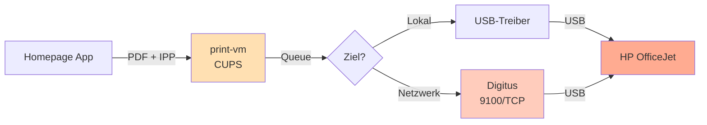

# 🌐 Netzwerk-Topologie

Detaillierte Übersicht der Netzwerk-Architektur, VLAN-Segmentierung und Datenflüsse.

---

## Überblick



---

## Netzwerk-Segmentierung

### VLAN 0: Management & Monitoring
**Zweck:** Host-Management, Monitoring, Admin-Zugriff

```
┌─────────────────────────────────────────┐
│ VLAN 0: Management (192.168.1.0/24)    │
├─────────────────────────────────────────┤
│ • Proxmox Host              192.168.1.2 │
│ • Debian Monitoring Server  192.168.1.3 │
│ • Grafana                   192.168.1.3:3002 │
│ • Prometheus                192.168.1.3:9091 │
│ • Cockpit                   192.168.1.3:9090 │
└─────────────────────────────────────────┘
```

### VLAN 1: Services (vmbr0)
**Zweck:** Produktive Anwendungen & Container

```
┌─────────────────────────────────────────┐
│ VLAN 1: Services (192.168.10.0/24)     │
├─────────────────────────────────────────┤
│ • Jellyfin                  192.168.10.x│
│ • Forgejo                   192.168.10.x│
│ • Vaultwarden               192.168.10.x│
│ • Immich                    192.168.10.x│
│ • FileBrowser               192.168.10.x│
│ • Weitere Container         192.168.10.x│
└─────────────────────────────────────────┘
```

### VLAN 2: Print (vmbr1)
**Zweck:** Druckinfrastruktur isoliert

```
┌─────────────────────────────────────────┐
│ VLAN 2: Print (192.168.20.0/24)        │
├─────────────────────────────────────────┤
│ • print-vm (CUPS)           192.168.20.2│
│ • Digitus Printserver       192.168.20.3│
│ • HP OfficeJet 4558         192.168.20.4│
└─────────────────────────────────────────┘
```

### VLAN 3: Guest/IoT (optional)
**Zweck:** Gäste-Netzwerk, IoT-Geräte, Isolation

```
┌─────────────────────────────────────────┐
│ VLAN 3: Guest/IoT (192.168.30.0/24)    │
├─────────────────────────────────────────┤
│ • Gäste-SSID                            │
│ • IoT-Geräte (Smart-Home, etc.)        │
│ • Begrenzte interne Ressourcen         │
└─────────────────────────────────────────┘
```

---

## Datenflüsse

### 📊 Monitoring-Flow



### 🖨️ Print-Flow



### 🔐 Firewall-Regeln

**Incoming (WAN → LAN):**
- SSH (22/TCP) → Proxmox + Debian nur von Admin-IP
- HTTPS (443/TCP) → Services (optional Reverse-Proxy)

**Internal (LAN-interne Regeln):**
- VLAN 0 ↔ VLAN 1: Erlaubt (Management ↔ Services)
- VLAN 0 ↔ VLAN 2: Eingeschränkt (nur Monitoring + Print)
- VLAN 1 ↔ VLAN 2: Blockiert (Print-Isolation)
- VLAN 3: Blockiert zu VLAN 0, 1, 2 (Guest-Isolation)

---

## Bridge-Konfiguration (Proxmox)

### vmbr0 (Services)
```bash
auto vmbr0
iface vmbr0 inet static
    address 192.168.1.2
    netmask 255.255.255.0
    gateway 192.168.1.1
    bridge_ports eth0
    bridge_stp off
    bridge_fd 0
```

### vmbr1 (Print VLAN)
```bash
auto vmbr1
iface vmbr1 inet static
    address 192.168.20.1
    netmask 255.255.255.0
    bridge_ports eth1  # oder via VLAN-Tagging
    bridge_stp off
    bridge_fd 0
```

---

## Wichtige Ports & Protokolle

| Port | Protokoll | Service | VLAN | Richtung |
|------|-----------|---------|------|----------|
| 22 | SSH | Admin | 0 | Bidirektional |
| 631 | IPP | CUPS | 2 | VLAN1 → VLAN2 |
| 9100 | JetDirect | Digitus | 2 | print-vm → Digitus |
| 515 | LPD | Print (Legacy) | 2 | Bidirektional |
| 9091 | HTTP | Prometheus | 0 | Internal |
| 3002 | HTTP | Grafana | 0 | Internal |
| 3100 | HTTP | Loki | 0 | Internal |
| 3001 | HTTP | Uptime Kuma | 0 | Internal |
| 9090 | HTTPS | Cockpit | 0 | Internal |
| 8085 | HTTP | Scrutiny | 0 | Internal |
| 5353 | UDP | mDNS/Avahi | All | Broadcast |

---

## Fehlerbehebung

### Druck geht nicht
```bash
# 1. print-vm erreichbar?
ping 192.168.20.2

# 2. CUPS läuft?
ssh 192.168.20.2
systemctl status cups

# 3. Digitus erreichbar?
telnet 192.168.20.3 9100

# 4. Logs anschauen
journalctl -u cups -f
```

### Monitoring weg
```bash
# Prometheus auf Debian Server
ssh 192.168.1.3
systemctl status prometheus

# Verbindung zu Prometheus testen
curl http://localhost:9091/-/healthy
```

### Netzwerk langsam
```bash
# Bridge-Status
brctl show

# VLAN-Tags prüfen
ip link show

# Durchsatz testen
iperf3 -c <ziel-ip>
```

---

## Netzwerk-Optimierung

### Empfohlene Einstellungen

#### Proxmox MTU
```bash
# Jumbo Frames (optional, wenn Switch unterstützt)
ip link set mtu 9000 dev eth0
```

#### Print-Gateway Optimierung
```bash
# CUPS Max-Clients erhöhen (print-vm)
echo "MaxClients 500" >> /etc/cups/cupsd.conf
systemctl restart cups
```

#### Monitoring-Retention
```bash
# Prometheus Daten nicht zu lange speichern
--storage.tsdb.retention.time=30d
```

---

## Sicherheit

### Best Practices

1. **SSH-Keys** statt Passwörter verwenden
2. **Firewall** auf Proxmox + Debian aktivieren
3. **VLAN-Isolation** konsequent nutzen (Guest/Print trennen)
4. **Regelmäßige Updates** einspielen
5. **Backups** der Konfigurationen machen

### UFW (Debian Firewall)

```bash
# Basis-Regeln
ufw default deny incoming
ufw default allow outgoing
ufw allow from <admin-ip> to any port 22

# Monitoring-Zugriff erlauben
ufw allow from 192.168.1.0/24

# Print-VLAN einschränken
ufw allow from 192.168.20.0/24 to 192.168.20.1
```

---

**Siehe auch:**
- [`Netzwerk/README.md`](./README.md) — Allgemeine Netzwerk-Hinweise
- [`Netzwerk/printserver-digitus.md`](./printserver-digitus.md) — Digitus-Spezifikationen
- [`Proxmox/README.md`](../Proxmox/README.md) — Proxmox Host-Konfiguration
