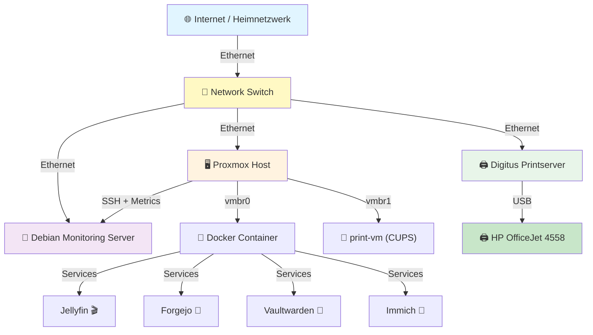

# 🏠 Hoinkkoma Homelab — Übersicht

**Letzte Aktualisierung:** 2026-08-13

Moin Moin Leude das ist mein homlap projekt die repro ist ne kleine dokumatirung des projektes 
in der alles kurtz zusammen gefast ist 

---

## 📋 Inhaltsverzeichnis

1.  [Alle Geräte](#alle-geräte)  
2.  [Zweck & Übersicht](#zweck--übersicht)
3. [Architektur (Grafisch)](#architektur-grafisch)
4. [Zwei Hauptkategorien](#zwei-hauptkategorien)
   - [🐧 Debian Server](#-debian-server)
   - [🖥️ Proxmox VE](#️-proxmox-ve)
5. [Netzwerk-Topologie](#netzwerk-topologie)
6. [Anwendungen & Dienste](#anwendungen--dienste)
7. [Schnelleinstieg](#schnelleinstieg)
8. [Dokumentation & Wiki](#dokumentation--wiki)
9. [Wartung & Support](#wartung--support)
   
## Alle Geräte

Hier ist eine bereinigte Liste der vorhandenen Geräte im Homelab.

| Gerät | Typ | Standort / Notizen |
|---|---:|---|
| Proxmox ThinkCentre Tower PC | Virtualisierungs-Host (Proxmox VE) | Tower, VMs & LXC, USB-Passthrough |
| Debian Server (Mini-PC) | Monitoring & Services | Prometheus, Grafana, Loki, Cockpit |
| Digitus Print Server | Print-Gateway (CUPS) | Verbunden mit HP OfficeJet |
| ThinkPad T490s | Laptop | Administration / Mobile Arbeit |
| HP OfficeJet 4558 | Drucker | USB / JetDirect, über Digitus erreichbar |
| Nothing Phone 3a | Smartphone | Mobilgerät |
| ThinkBook | Laptop | Allgemeiner Gebrauch |

---

## Zweck & Übersicht

**Kurzübersicht** über die eingesetzte Infrastruktur, deren Komponenten und die Druck-Pipeline.

### Was ist dieses Homelab?

Ein **selbstgehostetes Infrastruktur-Ökosystem** mit:
- ✅ **Virtualisierung** (Proxmox VE)
- ✅ **Monitoring & Logging** (Prometheus, Grafana, Loki)
- ✅ **Anwendungen** (Jellyfin, Forgejo, Immich, uvm.)
- ✅ **Druckinfrastruktur** (CUPS → Printserver → Drucker)
- ✅ **Verwaltung & Troubleshooting** Tools

---

## Architektur (Grafisch)

```
┌────────────────────────────────────────────────────────────────┐
│                    Hoinkkoma Homelab                            │
└────────────────────────────────────────────────────────────────┘

                     ┌─────────────────┐
                     │  🌐 INTERNET    │
                     │ (Heimnetzwerk)  │
                     └────────┬────────┘
                              │
                     ┌────────▼────────┐
                     │    🔀 SWITCH    │
                     └────┬────────┬───┘
                          │        │
            ┌─────────────┘        └─────────────┐
            │                                    │
    ┌───────▼──────────┐            ┌───────────▼──────┐
    │  🖥️ PROXMOX HOST │            │ 🐧 DEBIAN SERVER │
    │ (Virtualisierung)│            │  (Monitoring)    │
    ├──────────────────┤            ├──────────────────┤
    │ • VMs            │◄──────────►│ • Prometheus     │
    │ • LXC Container  │ (SSH+Metr.)│ • Grafana        │
    │ • Docker         │            │ • Loki (Logs)    │
    │ • print-vm CUPS  │            │ • Uptime Kuma    │
    └─────────┬────────┘            │ • Scrutiny       │
              │                     │ • Cockpit        │
              │ (vmbr0, vmbr1)      └──────────────────┘
              │
      ┌───────┴─────────┐
      │                 │
  ┌───▼──────┐    ┌────▼──────────────┐
  │ Services │    │ 🖨️ DIGITUS        │
  │Container │    │ PRINTSERVER       │
  │          │    ├───────────────────┤
  │ Jellyfin │    │ Connected via:    │
  │ Forgejo  │    │ Ethernet/Switch   │
  │Vaultwarden    │  to Proxmox Host  │
  │ Immich   │    │                   │
  └──────────┘    └────────┬──────────┘
                           │ (USB)
                  ┌────────▼──────────┐
                  │  🖨️ HP OFFICEJET │
                  │      4558        │
                  └──────────────────┘
```

**Grafische Version:** Siehe [Netzwerk-Topologie](#netzwerk-topologie)

---

## Zwei Hauptkategorien

### 🐧 Debian Server

**Zentrale Verwaltungs- & Monitoring-Plattform**

| Bereich | Beschreibung | Dateien |
|---------|-------------|---------|
| **Monitoring** | Prometheus, Grafana, Loki, Uptime Kuma, Scrutiny, Cockpit | `Debian-Monitoring/README.md` |
| **Services** | SSH, NTP, DNS-Caching, Syslog | `Debian/README.md` |
| **Konfiguration** | Systemd, Netzwerk, Firewall, Updates | `Debian/config/` |

📖 **Detaillierte Anleitung:** [`Debian-Server/`](./Debian-Monitoring/)

---

### 🖥️ Proxmox VE

**Hypervisor & Virtualisierungs-Host**

| Bereich | Beschreibung | Dateien |
|---------|-------------|---------|
| **VMs & Container** | LXC Container, VM-Verwaltung | `Proxmox/README.md` |
| **Print-Gateway** | print-vm (CUPS-Server) | `Proxmox/printer-vm.md` |
| **Storage & Netzwerk** | vmbr0, vmbr1, USB-Passthrough | `Proxmox/README.md` |
| **Automatisierung** | Print-Worker, Systemd-Services | `Proxmox/print-worker.service` |

📖 **Detaillierte Anleitung:** [`Proxmox/`](./Proxmox/)

---

## Netzwerk-Topologie



---

## Anwendungen & Dienste

### Medien & Datenverwaltung
- **Jellyfin** — Medienserver (Filme, Serien, Musik)
- **Immich** — Foto-Management & Cloud-Storage
- **FileBrowser** — Web-basierter Dateimanager

### Infrastruktur & Verwaltung
- **Forgejo** — Self-Hosted Git-Server
- **Vaultwarden** — Passwortmanager
- **Portainer** — Docker-Management UI

### Monitoring & Überwachung
- **Prometheus** — Metrik-Erfassung
- **Grafana** — Dashboards & Visualisierung
- **Loki** — Log-Aggregation
- **Uptime Kuma** — Service-Monitoring
- **Scrutiny** — Festplatten-Überwachung (S.M.A.R.T.)
- **Netdata** — Performance-Monitoring

### System & Sicherheit
- **ClamAV** — Antivirus-Scanner
- **Cockpit** — Webbasierte Serververwaltung

📖 **Alle Dienste:** [`docs/apps.md`](./docs/apps.md)

---

## Schnelleinstieg

### 1️⃣ Erste Schritte (nach Installation)

- [ ] **Switch:** Internet & beide Hauptserver verbinden (Proxmox + Debian)
- [ ] **Digitus:** Mit Switch verbinden & mit HP OfficeJet koppeln
- [ ] **Proxmox:** Netzwerk-Bridges konfigurieren (`vmbr0`, `vmbr1`)
- [ ] **Debian Server:** Basis-Services starten
- [ ] **Monitoring:** Prometheus + Grafana aktivieren
- [ ] **Druck:** print-vm + Digitus verbinden

📖 **Anleitung:** `Proxmox/README.md` + `Debian-Monitoring/README.md`

### 2️⃣ Tägliche Wartung

```bash
# System-Status prüfen
systemctl status
docker ps

# Logs anschauen
journalctl -e
loki logs

# Metriken in Grafana
http://debian-server:3002
```

📖 **Checklisten:** [`Wartung/`](./Wartung/)

### 3️⃣ Probleme beheben

- Dienst ist down? → [`Fehlerbehebung/`](./Fehlerbehebung/)
- Druck funktioniert nicht? → [`Proxmox/printer-vm.md`](./Proxmox/printer-vm.md)
- Netzwerk-Issues? → [`Netzwerk/README.md`](./Netzwerk/)

---

## Dokumentation & Wiki

### Kategorische Übersicht

#### 🐧 Debian Server
- `Debian-Monitoring/README.md` — Monitoring & Services
- `Debian/README.md` — Konfiguration & Setup
- `Debian/config/` — Konfigurationsdateien

#### 🖥️ Proxmox VE
- `Proxmox/README.md` — Host & VM-Verwaltung
- `Proxmox/printer-vm.md` — Print-Gateway Setup
- `Proxmox/print-worker.service` — Systemd-Service

#### 🌐 Netzwerk
- `Netzwerk/README.md` — Netzwerk-Architektur
- `Netzwerk/network-diagram.md` — Topologie & Segmentierung
- `Netzwerk/printserver-digitus.md` — Printserver-Konfiguration

#### 🐳 Anwendungen
- `Docker/README.md` — Docker & Portainer
- `docs/apps.md` — Alle Dienste im Überblick

#### 🔧 Wartung & Support
- `Wartung/` — Regelmäßige Aufgaben
- `Fehlerbehebung/` — Troubleshooting

#### 📦 Ressourcen
- `assets/` — Grafiken & Diagramme
- `CHANGELOG.md` — Versionshistorie
- `CONTRIBUTING.md` — Mitarbeit

---

## Wartung & Support

### ✅ Tägliche Checks (morgens)
```
□ Alle Services up?        systemctl status
□ Kritische Alerts?        Grafana Dashboard
□ Disk-Space OK?           Scrutiny / df -h
□ Netzwerk stabil?         ping <services>
□ Druck verfügbar?         Digitus erreichbar?
```

### ⚠️ Häufige Probleme

| Problem | Ursache | Lösung |
|---------|---------|--------|
| Druck geht nicht | Digitus offline | Digitus mit Switch neu verbinden |
| print-vm nicht erreichbar | Netzwerk-Bridge fehlt | vmbr1 in Proxmox prüfen |
| Monitoring weg | Prometheus down | `systemctl restart prometheus` auf Debian |
| Netzwerk langsam | Switch/Firewall? | Siehe `Netzwerk/README.md` |
| Docker voll | Storage nicht geleert | `docker system prune -a` |

📖 **Ausführlich:** [`Fehlerbehebung/`](./Fehlerbehebung/)

---

## Wichtige Ports & Services

| Service | Port | Protokoll | Host |
|---------|------|-----------|------|
| Grafana | 3002 | HTTP | Debian Server |
| Prometheus | 9091 | HTTP | Debian Server |
| Loki | 3100 | HTTP | Debian Server |
| Uptime Kuma | 3001 | HTTP | Debian Server |
| Cockpit | 9090 | HTTPS | Debian Server |
| Scrutiny | 8085 | HTTP | Debian Server |
| CUPS (IPP) | 631 | TCP | print-vm |
| JetDirect | 9100 | TCP | Digitus |
| SSH | 22 | TCP | Alle |

---

## 📄 Lizenz

Apache License 2.0 — Siehe [`LICENSE`](./LICENSE)

---

## 🤝 Beitragen

Fehler gefunden? Verbesserungen? Siehe [`CONTRIBUTING.md`](./CONTRIBUTING.md)

---

**Letztes Update:** 2026-08-13 | **Maintainer:** [@Hoinkkoma](https://github.com/Hoinkkoma)
