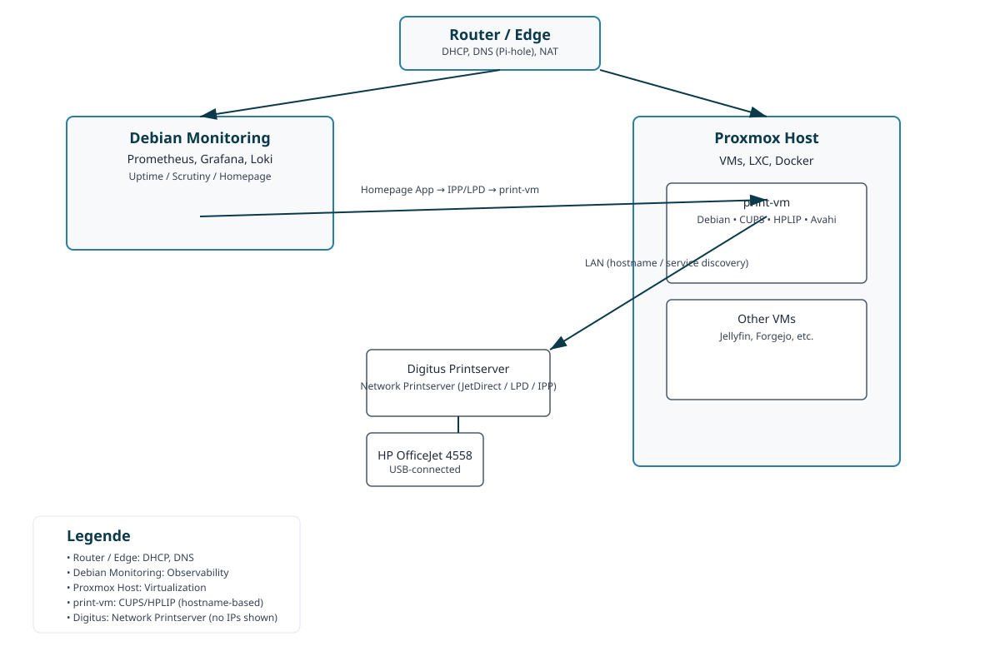

# 🏠 Hoinkkoma Homelab Dokumentation

**Letzte Aktualisierung:** 2026-08-13

Willkommen zur Dokumentation meines Homelabs! 👋 Hier findest du einen kompletten Überblick über die Infrastruktur, Dienste und Konfigurationen.

---

## 📋 Inhaltsverzeichnis

- [🎯 Überblick](#-überblick)
- [🏗️ Architektur](#️-architektur)
- [🖥️ Server & Hardware](#️-server--hardware)
- [📊 Monitoring & Verwaltung](#-monitoring--verwaltung)
- [🐳 Dienste & Anwendungen](#-dienste--anwendungen)
- [🖧 Netzwerk](#-netzwerk)
- [📚 Dokumentation](#-dokumentation)
- [💾 Backup & Recovery](#-backup--recovery)
- [🚀 Roadmap](#-roadmap)

---

## 🎯 Überblick

Das Homelab ist eine verteilte Infrastruktur mit drei Hauptkomponenten:

| Komponente | Rolle | OS | Aufgaben |
|-----------|------|----|----|
| **🖥️ Debian Monitoring Server** | Verwaltung & Überwachung | Debian 12 | Prometheus, Grafana, Loki, Uptime Kuma, Scrutiny, Homepage |
| **🔶 Proxmox Server** | Hosting-Plattform | Proxmox VE | VMs, LXC Container, Docker, Dienste |
| **🖨️ Print Gateway (VM auf Proxmox)** | Druck-Management | Debian (VM) | CUPS, HPLIP — Anbindung Digitus Printserver & HP OfficeJet 4558 |

**Zentrale Zugriffsstelle:** [Homepage Dashboard](http://[LOKAL]:80) - Single Pane of Glass für alle Dienste

---

## 🏗️ Architektur

Illustration der Architektur (inkl. Digitus Printserver + HP OfficeJet 4558):

Hinweis: Der Digitus steht als Netzwerk-Printserver zwischen der VM und dem Drucker; alternativ kann der Drucker per USB direkt an die VM oder an den Proxmox-Host mit USB-Passthrough angebunden werden.

---

## 🖧 Netzwerk-Topologie

- **LAN:** Router (DHCP, DNS via Pi-hole)
- **Print-Netz:** Digitus Printserver mit statischer Zuweisung oder DHCP-Reservierung (Hostname/Reservierung empfohlen)
- **VM-Netzwerk:** print-vm auf Proxmox mit statischem Hostnamen oder DHCP-Reservierung
- **VPN:** Tailscale für sicheren Remote-Zugriff und Inter-Server-Kommunikation
- **DNS:** Pi-hole (zentral, mit lokalen DNS-Records)
- **Monitoring:** Prometheus → Grafana + Loki (zentrale Metriken & Logs)

---

### Drucker-Topologie (kurz)

- Die Print-VM (Debian) hostet CUPS und HPLIP und ist das lokale Druck-Gateway.
- Digitus Printserver ist per LAN mit dem Switch verbunden und per USB mit dem HP OfficeJet 4558.
- CUPS kann den Digitus via Hostname oder Device-URI (z. B. socket://<DIGITUS_HOSTNAME>:9100) einbinden oder direkt via lpd/ipp; die Homepage-App sendet Druckaufträge an die Print-VM (IPP oder Dateiablage watched by print-worker).

---

(Rest der Dokumentation bleibt strukturiert wie zuvor; spezifische Kapitel sind unten verlinkt.)

## 🖥️ Server & Hardware

### 🖥️ Server 1: Debian Monitoring Server

**Spezifikation:**
- OS: Debian 12 (Bookworm)
- Aufgaben: Management, Monitoring, zentrale Verwaltung
- Speicher: TBD
- Netzwerk: LAN Kabel (statische IP oder DHCP-Reservierung via Hostname)

**Verwaltungs-Interfaces:**
| Service | URL | Port | Beschreibung |
|---------|-----|------|-------------|
| Cockpit | `https://[LOKAL]:9090` | 9090 | Webbasierte Serververwaltung |
| Prometheus | `http://[LOKAL]:9091` | 9091 | Metrik-Datenbank |
| Grafana | `http://[LOKAL]:3002` | 3002 | Dashboards & Visualisierung |
| Loki | `http://[LOKAL]:3100` | 3100 | Log-Aggregation |
| Uptime Kuma | `http://[LOKAL]:3001` | 3001 | Service-Monitoring |
| Scrutiny | `http://[LOKAL]:8085` | 8085 | SMART-Festplatten-Überwachung |
| Homepage | `http://[LOKAL]:80` | 80 | Dashboard & Links |

---

(Der Rest des Dokuments bleibt unverändert; detaillierte Abschnitte findest du in den jeweiligen Unterordnern.)
